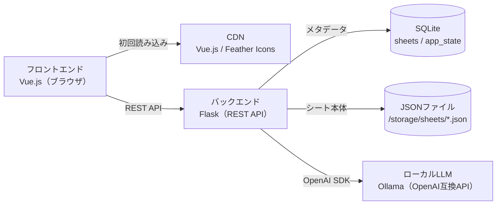

# brAIn Storming

# 概要

AIのサポート機能がついたブレインストーミングのシート管理アプリです。仕様の詳細は [design-document.md](design-document.md) を参照してください。

- フロントエンド: Vue.js（CDN版、ビルドツールなし）
- バックエンド: Python, Flask, OpenAI SDK経由でローカルのOllamaを利用
- DB: sqlite

## システム構成



詳細は [design-document.md](design-document.md) の5.1を参照してください。

# 環境
- Vscode
- OpenCode
- ollama

# 開発ツールインストール

- 管理者権限でコマンドプロンプトを起動します。

- 以下のコマンドを実行し、必要なソフトウェアを入手します。

```
winget install --id Microsoft.VisualStudioCode -e --source winget --accept-package-agreements --accept-source-agreements
winget install --id Python.Python.3.13 -e --source winget --accept-package-agreements --accept-source-agreements
winget install --id Ollama.Ollama -e --source winget --accept-package-agreements --accept-source-agreements
```

ollama で任意のモデルを入手してください。  
以下は `qwen2.5-coder:0.5b` モデルを入手する例です。  
```

ollama pull qwen2.5-coder:0.5b
```


# 環境セットアップ

- Python 仮想環境構築

  > Windows PowerShell 上で作業します。  

  以下のコマンドでPythonの仮想環境を構築します。  

  ```
  python -m venv .venv
  ```

  > `/.venv` ディレクトリが作成されます。  
  > `.gitignore` によって `/.venv` ディレクトリはGit管理から外されています。  

  以下のコマンドで仮想環境をアクティベートします。  

  ```
  Set-ExecutionPolicy -Scope Process -ExecutionPolicy Bypass
  .\.venv\Scripts\activate
  ```

  > 成功すると、ターミナルに `(.venv)` と表示されます。  
  > 以降、Python や pip などを実行する際は**仮想環境内で実行**してください。  

  仮想環境を終了する場合は、以下のコマンドを使うか、ターミナルを終了します。  

  ```
  deactivate
  ```

  > コマンドの実行が成功すると、 `(.venv)` の表示が消えます。  

- Python ライブラリインストール

  以下のコマンドでPythonの利用ライブラリをインストールします。

  ```
  pip install -r requirements.txt
  ```

- `.env` ファイル作成

  以下のコマンドで `.env.example` をコピーして `.env` を作成します。

  ```
  copy .env.example .env
  ```

  > `.env` は必要に応じて値を書き換えてください。

# 実行方法

- ollama サーバの起動

  > アプリ利用時に自動で ollama が起動している場合もあります。必要に応じて手動で起動してください。  

  以下のコマンドで ollama のサーバを起動します。

  コマンドプロンプトでバックグラウンドプロセスとして起動する場合:  
  
  ```
  start /b ollama serve > NUL 2>&1
  ```

  PowerShell 上で起動する場合:  

  ```
  ollama serve
  ```

- アプリケーションサーバの起動
  
  以下のコマンドでサーバを起動します。

  ```
  python app.py
  ```

- アプリの起動

  ブラウザで以下のURLにアクセスしてください。

  ```
  http://localhost:5000
  ```

> 本アプリは初期リリースではローカルモデルのみに対応します（design-document.md 2章参照）。クラウドモデルの利用は将来拡張です。
